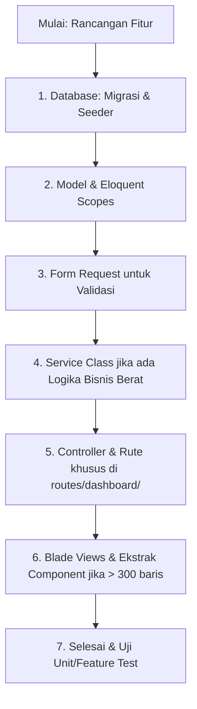

# Panduan Standar Kode & Manajemen File Laravel
## MAM Limpung Developer Guidelines

Dokumen ini adalah panduan resmi standar arsitektur dan aturan manajemen file untuk mempermudah pemeliharaan (*maintenance*), skalabilitas, dan kerapian kode seiring berkembangnya fitur aplikasi.

---

## 1. Aturan Batas Maksimal Baris File (Max Line Limits)
Untuk menghindari file raksasa (*god files*) yang sulit dipahami dan didebug, tetapkan batas baris maksimal sebagai berikut:

| Tipe File | Batas Maksimal | Tindakan Jika Melebihi Batas |
| :--- | :--- | :--- |
| **Controller** | 200 Baris | Pecah menjadi *Single Action Controllers* (Invokable) atau pisahkan sub-fitur ke Controller baru. |
| **Blade View (HTML)** | 300 Baris | Ekstrak bagian UI yang berulang atau besar menjadi sub-view (`@include('...partials...')`) atau Blade Component (`<x-card>`). |
| **Service Class** | 250 Baris | Pecah logika bisnis menjadi sub-service yang lebih spesifik (prinsip *Single Responsibility*). |
| **Route File** | 100 Baris | Buat file rute baru di folder `routes/dashboard/` dan kelompokkan rute berdasarkan modul. |

---

## 2. Struktur File Menu & Submenu (Folder Structure)

Jika Anda ingin menambahkan fitur baru yang memiliki menu utama dan beberapa submenu, ikuti struktur direktori modular berikut:

### Contoh Kasus: Fitur PPDB (Penerimaan Peserta Didik Baru)

```text
app/
├── Http/
│   ├── Controllers/
│   │   └── Dashboard/
│   │       └── Ppdb/
│   │           ├── AdminPpdbController.php              # Submenu: Daftar Pendaftar
│   │           ├── AdminPpdbSettingController.php       # Submenu: Pengaturan Form & Umum
│   │           ├── AdminPpdbGoogleSheetsController.php  # Submenu: Integrasi Google Sheets
│   │           └── AdminPpdbExportController.php        # Fitur Pembantu: Ekspor Data
│   └── Requests/
│       └── Dashboard/
│           └── Ppdb/
│               ├── UpdateGeneralSettingRequest.php
│               └── SaveRequirementsRequest.php
├── Services/
│   └── Ppdb/
│       ├── PpdbExportService.php                        # Logika berat ekspor Excel/PDF
│       └── GoogleSheetsSyncService.php                  # Logika integrasi API Google Sheets
│
resources/
├── views/
│   └── dashboard/
│       └── admin/
│           └── ppdb/
│               ├── index.blade.php                      # Halaman utama daftar pendaftar
│               ├── show.blade.php                       # Detail pendaftar
│               ├── settings.blade.php                   # Halaman konfigurasi PPDB
│               └── partials/                            # Bagian UI kecil/komponen khusus PPDB
│                   └── status-badge.blade.php
│
routes/
└── dashboard/
    └── ppdb.php                                         # Rute khusus untuk seluruh fitur PPDB
```

---

## 3. Alur Pembuatan Fitur Baru / Tambah Menu
Ketika ada instruksi membuat fitur baru (misal: "Manajemen Piket"), ikuti langkah-langkah terstruktur ini:



### Langkah Detail:
1. **Database & Seeder**: Buat file migrasi dan seeder data dummy.
2. **Model**: Definisikan properti, tipe data casting, relasi, dan *query scopes*.
3. **Form Request**: Jangan lakukan validasi di Controller. Gunakan file Request khusus.
4. **Service**: Pindahkan pemrosesan data kompleks dari Controller ke Service.
5. **Routing**: Daftarkan rute di file terpisah (misal: `routes/dashboard/piket.php`) agar rute utama `web.php` tetap bersih.
6. **Views**: Buat folder khusus untuk menu tersebut di `resources/views/dashboard/admin/`.

---

## 4. Pola Controller Profesional & Bersih (Slim Controller)
Controller yang profesional **hanya bertugas menerima request, memanggil service/model, dan mengembalikan response (view/redirect)**. 

### Hindari (Fat Controller ❌):
```php
public function store(Request $request)
{
    // Hindari validasi langsung di sini
    $request->validate([...]);

    // Hindari pemrosesan data berat atau API pihak ketiga langsung di sini
    $client = new Google\Client();
    $client->setAccessToken(...);
    // ... 100 baris kode integrasi ...

    return redirect()->back();
}
```

### Rekomendasi (Slim Controller & Service Layer ✔️):
```php
public function updateSettings(UpdateGeneralSettingRequest $request, PpdbSettingService $service): RedirectResponse
{
    // Validasi otomatis terjadi di kelas UpdateGeneralSettingRequest
    
    // Logika bisnis dijalankan oleh Service
    $service->saveGeneralConfig($request->validated());

    return redirect()->route('admin.ppdb.settings.edit')
        ->with('success', 'Konfigurasi PPDB berhasil diperbarui.');
}
```

---

## 5. Kapan Menggunakan Service, Repository, atau Pola Lain?

Untuk menjaga kode tetap modular, gunakan aturan penempatan logika berikut:

### A. Service Layer (`app/Services/`)
* **Kapan digunakan?** Ketika ada logika bisnis yang kompleks, kalkulasi data berat, manipulasi file (seperti ekspor PDF/Excel), atau integrasi dengan API pihak ketiga (seperti Google Sheets API).
* **Contoh**: `GoogleSheetsSyncService`, `PdfExportService`.

### B. Form Request (`app/Http/Requests/`)
* **Kapan digunakan?** Selalu gunakan Form Request untuk validasi input form yang memiliki lebih dari 3 input atau memerlukan aturan validasi khusus (seperti validasi format file atau pengecekan database).
* **Contoh**: `StorePendaftarRequest`.

### C. Eloquent Query Scopes (Di dalam Model)
* **Kapan digunakan?** Dibandingkan menggunakan Repository Pattern yang sering kali terlalu rumit untuk aplikasi Laravel standar, lebih disarankan menggunakan **Eloquent Query Scopes** untuk menyederhanakan query database yang berulang.
* **Contoh**:
  ```php
  // Di dalam Model PpdbSiswa
  public function scopeYangDiterima($query)
  {
      return $query->where('status', 'diterima');
  }

  // Cara penggunaan di Controller:
  $siswaDiterima = PpdbSiswa::yangDiterima()->get();
  ```

---

## 6. Standar Penamaan File & Variabel (Naming Conventions)

Konsistensi penamaan mempermudah pencarian file menggunakan *shortcut* editor (seperti `Ctrl + P`).

| Komponen | Aturan Penamaan | Contoh |
| :--- | :--- | :--- |
| **Model** | Singular, PascalCase | `PpdbSiswa`, `JadwalPiket` |
| **Controller** | PascalCase, diakhiri kata `Controller` | `AdminPpdbController`, `PiketController` |
| **Service** | PascalCase, diakhiri kata `Service` | `GoogleSheetsSyncService` |
| **Form Request** | PascalCase, diawali aksi & diakhiri `Request` | `StorePiketRequest`, `UpdateProfileRequest` |
| **Blade Views** | lowercase, snake_case atau kebab-case | `settings.blade.php`, `daftar_piket.blade.php` |
| **Route Names** | lowercase, dot-notation, berhierarki | `admin.ppdb.index`, `admin.ppdb.settings.edit` |
| **Variabel PHP** | camelCase | `$siswaPendaftar`, `$isGateOpen` |
| **Database Table** | Plural, snake_case | `ppdb_siswa`, `jadwal_piket` |
| **Database Column** | snake_case | `nama_lengkap`, `is_verified` |

---

## 7. Tips Menjaga File Tetap Bersih (Best Practices)
1. **Gunakan Pint Formatter**: Jalankan perintah `vendor/bin/pint` secara berkala untuk menjaga kerapian penulisan sintaks PHP.
2. **Jangan Biarkan Kode Mati**: Hapus baris kode yang diberi komentar (*commented out code*) yang sudah tidak terpakai. Gunakan Git untuk melihat riwayat kode lama.
3. **Pecah Blade View Menjadi Partials**: Jika form di halaman HTML Anda sangat panjang (misalnya form registrasi dengan 50 input), buat sub-folder `partials/` dan bagi menjadi file-file kecil seperti `partials/step-1-biodata.blade.php`, `partials/step-2-berkas.blade.php`, lalu gabungkan di file utama menggunakan `@include()`.
