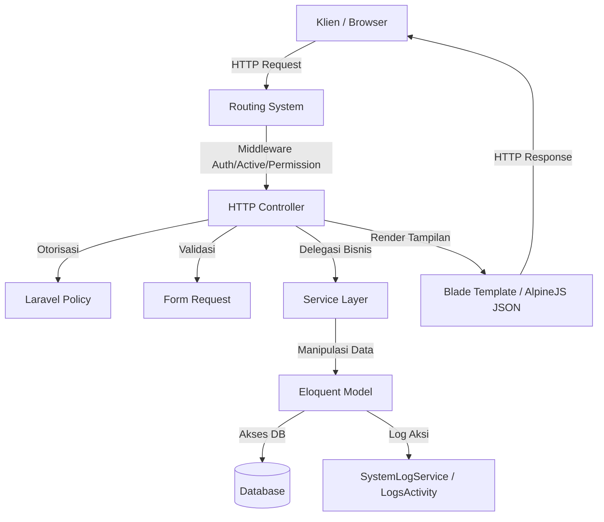

# ARCHITECTURE OVERVIEW

Dokumen ini menjelaskan struktur arsitektur sistem, alur data, pola desain, serta larangan arsitektural di dalam proyek MAM Limpung.

---

## 1. Gambaran Arsitektur Sistem
Aplikasi ini dikembangkan menggunakan framework **Laravel v13** dengan arsitektur klasik MVC (Model-View-Controller) yang diperkuat oleh pola-pola desain modern:
- **Presentation Layer**: Blade Templates terintegrasi dengan TailwindCSS v4 dan Alpine.js untuk sisi frontend/klien.
- **Logic / Controller Layer**: Controller yang ramping (thin controllers) untuk menangani permintaan HTTP, melakukan pengecekan otorisasi melalui Policy, dan mendelegasikan logika ke Service Layer jika diperlukan.
- **Data / Persistence Layer**: Eloquent ORM untuk pemetaan database dengan fitur soft-deletes dan audit logging otomatis via Traits.
- **Authorization & Security**: Spatie Permission (Role & Permission) dikombinasikan dengan Laravel Policies untuk membatasi akses di tingkat rute, controller, dan tampilan Blade.

## 2. Alur Data (Request → Logic → Response)
1. **Request Intake**: Request masuk melalui server web ke `public/index.php`, lalu dicocokkan dengan rute yang didefinisikan di `routes/`.
2. **Middleware Verification**: Rute dilindungi oleh middleware `auth` (untuk memastikan user login), `active` (untuk memastikan status akun aktif), dan middleware permission/role.
3. **Request Validation**: Sebelum masuk ke logika utama controller, data request divalidasi oleh class `FormRequest` khusus (misal: `StoreGaleriRequest` atau `UpdateGaleriRequest`). Jika gagal, sistem melempar respon validasi kembali ke klien.
4. **Authorization Check**: Di dalam controller, hak akses diverifikasi secara granular menggunakan `Gate::authorize()` atau `$this->authorize()` yang memetakan ke class Policy terkait.
5. **Business Logic Execution**: Controller mengeksekusi operasi database langsung (melalui Eloquent) atau mendelegasikan logika rumit ke Service (seperti `SystemLogService`).
6. **Activity Logging**: Event Eloquent (`created`, `updated`, `deleted`) memicu trait `LogsActivity` untuk secara otomatis merekam log perubahan data ke tabel `system_logs`.
7. **Response Generation**: Controller mengembalikan tampilan Blade yang diisi data dinamis (seringkali dilewatkan ke dalam skrip Alpine.js dalam bentuk JSON string).

## 3. Pola Desain Utama
- **Modular Routing**: Setiap modul memiliki file rute tersendiri di bawah `routes/dashboard/` yang dibaca secara otomatis menggunakan fungsi `glob` pada `routes/dashboard.php`.
- **Form Request Validation**: Logika validasi dipisahkan dari controller ke dalam folder `app/Http/Requests` untuk menjaga controller tetap bersih dan fokus.
- **Eloquent Resource / Mapping**: Memetakan model database ke struktur data yang sesuai untuk konsumsi frontend (seperti memetakan koleksi `Galeri` ke struktur JSON yang cocok untuk Alpine.js).
- **Activity Log Trait**: Menggunakan Event Eloquent Bootstrapping melalui trait `LogsActivity` untuk melacak perubahan data secara global tanpa menulis kode pencatatan log berulang-ulang di setiap controller.

## 4. Larangan Arsitektural (Anti-Pattern)
- **DILARANG** menuliskan query SQL mentah atau query Eloquent yang rumit secara langsung di dalam file Blade. Semua query data harus dilakukan di Controller atau Service.
- **DILARANG** melakukan validasi input HTTP menggunakan validator manual `$request->validate()` di dalam method controller. Gunakan Class Form Request khusus di `app/Http/Requests`.
- **DILARANG** memotong alur otorisasi Policy. Jangan menggunakan logika `if (Auth::user()->role == '...')` kasar di controller. Selalu gunakan `$this->authorize()` atau `Gate::authorize()`.
- **DILARANG** membuat rute dashboard baru di file `routes/web.php` secara langsung. Gunakan folder modular `routes/dashboard/` dan buat file rute baru di sana.
- **DILARANG** memanggil kelas model lain di dalam database migrations. Tulis definisi skema murni untuk menjaga migrasi tetap portabel dan independen.
