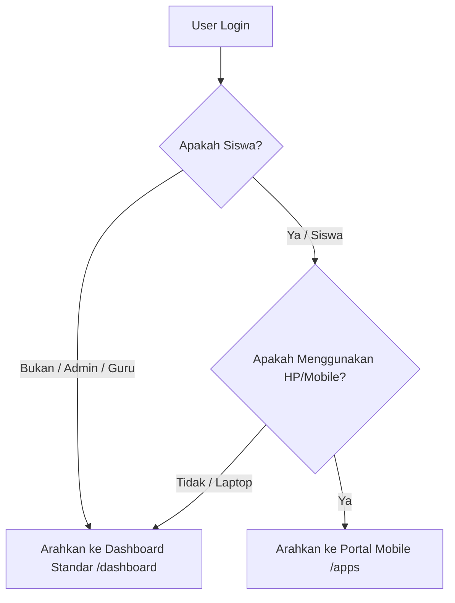

# DOKUMENTASI PORTAL MOBILE SISWA (PWA)

Dokumen ini mendefinisikan arsitektur, aturan alur logika pengalihan (redirection rules), struktur rute, komponen pengontrol, dan panduan Progressive Web App (PWA) pada portal mobile siswa untuk membantu pengembang di masa mendatang.

---

## 1. Pendahuluan
Portal Mobile Siswa dirancang khusus untuk memberikan pengalaman pengguna layaknya aplikasi seluler native (Single Page Application) bagi siswa Madrasah Aliyah Muhammadiyah (MAM) Limpung saat diakses melalui smartphone. 

Aplikasi ini menggunakan pendekatan **hybrid/PWA** (Progressive Web App) dengan visual yang cerah, modern, dan sangat responsif tanpa memerlukan memori penyimpanan yang besar karena diinstal secara instan dari web browser.

---

## 2. Tumpukan Teknologi (Tech Stack)
*   **Backend & Rendering**: Laravel v13 & Blade Templates.
*   **Navigasi SPA Tanpa Refresh**: **Hotwire Turbo** (interseptor tautan & form) untuk meminimalkan waktu tunggu muat halaman dan memberikan transisi halus antarhalaman.
*   **Interaksi UI Dinamis**: Alpine.js (untuk modal, dropdown, dan transisi tab tugas).
*   **Desain Antarmuka (Styling)**: Tailwind CSS v4 dengan utility class (skema warna terang & kontras tinggi).
*   **PWA Core**: `manifest.json` (metadata app) & `sw.js` (service worker dasar untuk caching asset luring).

---

## 3. Logika Pengalihan Perangkat & Peran (Redirection Rules)
Aplikasi ini memiliki sistem otorisasi dan deteksi agen pengguna (*User-Agent*) cerdas di sisi server untuk memetakan arah halaman pasca-masuk secara otomatis:

### Aturan Teknis Redirection:
1.  **Saat Proses Login**:
    *   Fungsi pembantu `dashboardRoute()` pada model [User.php](file:///d:/WEBSITE/JOB/MAM_LIMPUNG/app/Models/User.php) mengecek *User-Agent* dari header HTTP.
    *   Jika role adalah `siswa` dan perangkat adalah mobile, mengembalikan route `apps.home` (`/apps`).
    *   Jika siswa masuk melalui laptop/PC, maka diarahkan ke route `dashboard` (`/dashboard`).
2.  **Proteksi Akses URL Langsung (Middleware & Controller)**:
    *   Jika siswa mengakses `/dashboard` dari smartphone, [UnifiedDashboardController](file:///d:/WEBSITE/JOB/MAM_LIMPUNG/app/Http/Controllers/Dashboard/UnifiedDashboardController.php) akan otomatis mengalihkan mereka ke `/apps`.
    *   Jika selain siswa, atau siswa menggunakan laptop mencoba mengakses `/apps`, [AppsController](file:///d:/WEBSITE/JOB/MAM_LIMPUNG/app/Http/Controllers/Apps/AppsController.php) akan mengalihkan mereka kembali ke `/dashboard`.

---

## 4. Struktur Rute & Navigasi
Semua rute portal mobile didefinisikan dalam file [routes/mobile_apps.php](file:///d:/WEBSITE/JOB/MAM_LIMPUNG/routes/mobile_apps.php) di bawah kelompok middleware `auth` dan `active`:

*   **Prefix**: `/apps`
*   **Name Prefix**: `apps.`
*   **Daftar Rute**:
    1.  `apps.home` (`GET /apps`) &rarr; Menampilkan halaman beranda.
    2.  `apps.galeri` (`GET /apps/galeri`) &rarr; Menampilkan daftar kiriman galeri siswa & form upload.
    3.  `apps.galeri.store` (`POST /apps/galeri`) &rarr; Memproses unggahan galeri kegiatan baru.
    4.  `apps.artikel` (`GET /apps/artikel`) &rarr; Menampilkan draf artikel & form tulis artikel.
    5.  `apps.artikel.store` (`POST /apps/artikel`) &rarr; Memproses penyimpanan draf artikel baru.
    6.  `apps.tugas` (`GET /apps/tugas`) &rarr; Menampilkan daftar tugas (tugas mandiri).
    7.  `apps.profile` (`GET /apps/profile`) &rarr; Halaman akun siswa dan tindakan logout.

---

## 5. Struktur Pengontrol (Controllers)
Logika bisnis untuk aplikasi mobile dipisahkan secara modular pada direktori `app/Http/Controllers/Apps/`:

1.  **AppsController**: Menangani pemuatan statistik beranda, tampilan profil, pembaruan profil siswa (edit nama, email, dan unggah foto avatar dengan verifikasi kata sandi saat ini), serta pemrosesan permintaan tautan ganti kata sandi.
2.  **AppsGaleriController**: Memproses penyimpanan galeri usulan siswa ke tabel `galeris` dan berkas gambar ke `galeri_photos` di media penyimpanan publik. Status usulan siswa adalah `pending` secara default hingga diverifikasi admin.
3.  **AppsArtikelController**: Memproses penulisan artikel draf siswa ke tabel `articles` dengan melakukan sanitasi konten otomatis menggunakan `HtmlSanitizer::clean` untuk keamanan dari serangan XSS.
4.  **AppsTugasController**: Menampilkan daftar tugas sekolah (menggunakan simulasi data interaktif).

---

## 5.a Fitur Pengaturan Profil & Keamanan Tingkat Tinggi
*   **Unggah Foto Avatar**: Siswa dapat mengunggah foto profil/avatar mandiri (maksimal 1MB). Berkas disimpan secara aman di `storage/app/public/avatars` dengan nama acak unik untuk menghindari serangan penimpaan berkas.
*   **Verifikasi Kata Sandi Saat Ini**: Setiap perubahan pada nama lengkap, email, atau avatar wajib menyertakan verifikasi kata sandi saat ini (`current_password`) untuk mencegah pembajakan sesi atau perubahan data ilegal jika HP sedang dipinjam orang lain.
*   **Reset Kata Sandi Terintegrasi**: Siswa dapat mengklik tombol "Kirim Link Ganti Password" yang akan memicu pengiriman email tautan atur ulang kata sandi (`ForgotPasswordMail`) melalui antrean (queued) secara aman tanpa memaksa keluar sesi aktif siswa.

---

## 6. Konfigurasi PWA & Tombol Unduh Instan
1.  **Aksesibilitas PWA**:
    *   Berkas [manifest.json](file:///d:/WEBSITE/JOB/MAM_LIMPUNG/public/manifest.json) mendefinisikan identitas PWA, orientasi layar portrait, warna tema `#4f45b2`, serta ikon peluncur aplikasi.
    *   Berkas [sw.js](file:///d:/WEBSITE/JOB/MAM_LIMPUNG/public/sw.js) menginisialisasi service worker untuk caching dasar agar aplikasi dapat dipasang di homescreen.
2.  **Tombol Unduh (Floating FAB & QR Code)**:
    *   Dipasang di bagian bawah file master layout [app.blade.php](file:///d:/WEBSITE/JOB/MAM_LIMPUNG/resources/views/layouts/app.blade.php).
    *   Ketika pengguna desktop mengklik tombol ini, popup elegan akan muncul menampilkan **QR Code** dinamis yang terhubung ke API QR server luar untuk menerjemahkan URL lokal/produksi `/apps` secara instan, memudahkan siswa memindai layar laptop menggunakan kamera smartphone untuk masuk ke portal mobile.

---

## 7. Optimasi Performa & Latensi Login (PENTING)
Agar login berjalan lancar tanpa mengalami penundaan (delay) hingga puluhan detik, optimasi berikut diterapkan:
1.  **Asynchronous Email (Queued jobs)**: Proses pengiriman OTP di [SmtpService](file:///d:/WEBSITE/JOB/MAM_LIMPUNG/app/Services/SmtpService.php) dialihkan secara otomatis ke latar belakang menggunakan antrean basis data (`SendEmailJob` jika konfigurasi queue bukan `sync`), sehingga halaman verifikasi OTP termuat instan dalam milidetik.
2.  **Connection Timeout Capping**: Batas waktu koneksi ke host SMTP luar dipotong dari 30 detik menjadi **3 detik** di `SmtpService` dan `BaseMail`. Jika server SMTP terganggu, proses login tidak akan hang/macet.
